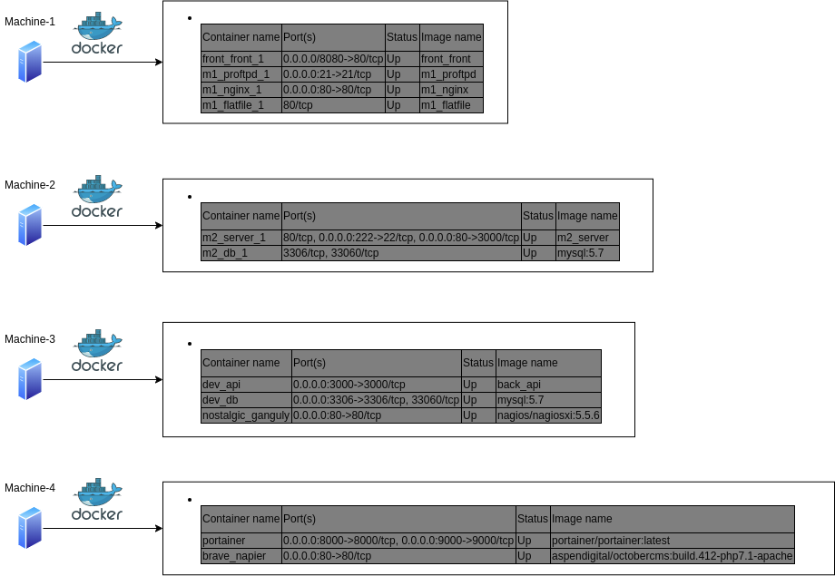
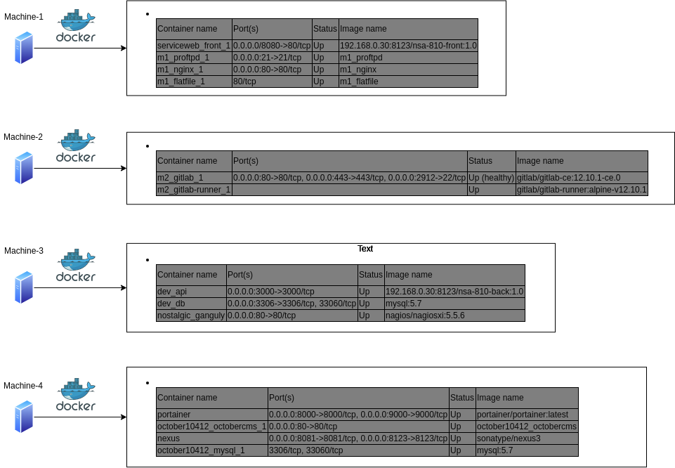

# CIA PROJECT

## REPORT – GROUP N°5

| Author | Contact |
| --- | --- |
| Wilfried RAYNAUD | [wilfried.raynaud@epitech.eu](mailto:wilfried.raynaud@epitech.eu) |
| Arnaud SINAYS | [arnaud.sinays@epitech.eu](mailto:arnaud.sinays@epitech.eu) |
| Lucas LEMOIGNE | [lucas.lemoigne@epitech.eu](mailto:lucas.lemoigne@epitech.eu) |

# SUMMARY

- [CIA PROJECT PRESENTATION](#cia-project-presentation)
  1. [INTRODUCTION](#introduction)
  2. [CONSTRAINTS](#constraints)
  3. [NEEDS AND GOALS](#needs-and-goals)
- [HOW WE GOT FULL ACCESS TO THE INFRASTRUCTURE](#how-we-got-full-access-to-the-infrastructure)
  1. [INFORMATION WE HAD TO BEGIN WITH](#information-we-had-to-begin-with)
  2. [INFORMATION RETRIEVED](#information-retrieved)
  3. [TABLE OF MACHINES RESOURCES AND USERS](#table-of-machines-resources-and-users)
  4. [INFRASTRUCTURE SCHEMA](#infrastructure-schema)
- [FIX WEB APP](#fix-web-app)
  1. [FIXING THE FRONT](#fixing-the-front)
  2. [FIXING THE API](#fixing-the-api)
- [API LOGGING SYSTEM](#api-logging-system)
- [NEXUS INSTALLED AND CONFIGURED TO STORE ALL ARTIFACTS](#nexus-installed-and-configured-to-store-all-artifacts)
  1. [WHY NEXUS ?](#why-nexus)
  2. [NEXUS SETUP](#nexus-setup)
  3. [HOW ARTIFACTS ARE RETRIEVED FROM NEXUS](#how-artifacts-are-retrieved-from-nexus)
- [GITLAB WITH CI/CD LINKED TO NEXUS](#gitlab-with-ci/cd-linked-to-nexus)
  1. [GITLAB SETUP](#gitlab-setup)
  2. [CI/CD PIPELINES](#ci/cd-pipelines)
- [AUDITING OTHER SERVICES](#auditing-other-services)
- [CONCLUSION](#conclusion)

# CIA PROJECT PRESENTATION

## INTRODUCTION

We have been recruited to replace the former system administrator and our first mission is to restore the web application. It was not functional and was paralyzing the inventory department. The company feared a cyber-attack against it in the upcoming weeks. So we had to take possession of the infrastructure and repair it. Then we had to meet all the needs and objectives provided by the manager.

## CONSTRAINTS

Four constraints to respect:

- API will not be moved to another host.
- The web application cannot be in the same host as the API.
- All services must be containerised.
- All containers must be launched with the user __service-web__.

## NEEDS AND GOALS

We had to make the infrastructure sustainable. For this we had to set up:

- A complete API logging system.
- A scripted integration and deployment system with Gitlab as a versionning service.
- An artifact management software linked to the deployment system.

We also had to fix any vulnerabilities we would encounter.

# HOW WE GOT FULL ACCESS TO THE INFRASTRUCTURE

## INFORMATION WE HAD TO BEGIN WITH

The website is hosted by four virtual machines:

- The web platform
- The API
- The Database
- The monitoring

The monitoring is managed by Portainer.

Some credentials (login and password) without the corresponding platform.

## INFORMATION RETRIEVED

This describes the steps we followed in order to gain information about the machines:

1. Get resources and ips by VM.
2. Try to log into the machine, making us writing our [first report about a security issue](security/ROOT_PASSWORD.md).
3. Identify which host is hosting which service and what are they supposed to do.

This allowed us to get the following tables & schema:

### TABLE OF MACHINES RESOURCES AND USERS

| Machine name | IP - DHCP | vCPU | RAM (GB) | Users |
| --- | --- | --- | --- | --- |
| Machine-1 | 192.168.1.64 | 2 | 2 | root, admin, soupeladmin, service-web |
| Machine-2 | 192.168.1.61 | 2 | 2 | root, admin, service-web |
| Machine-3 | 192.168.1.62 | 2 | 2 | root, admin, service-web |
| Machine-4 | 192.168.1.63 | 2 | 2 | root, admin |

### TABLE OF LAUNCHED CONTAINERS BY MACHINE



## FIX WEB APP

### FIXING THE FRONT

The web application is on the __machine-1__ host and its configuration is in the directory /home/service-web/front/.  
By looking at the source code we know it is supposed to communicate with the API we located on __machine-3__ .

We saw that the API IP address was incorrect in the web application .env file, so we decided to have a static IP address for each machine to fix this and prevent it from happening again.

New IP addresses:

| Machine name | IP - STATIC |
| --- | --- |
| Machine-1 | 192.168.43.201 |
| Machine-2 | 192.168.43.202 |
| Machine-3 | 192.168.43.203 |
| Machine-4 | 192.168.43.204 |

Still, there was an issue to log into the webapp, by looking at logs we realized there was an issue with the API.  

### FIXING THE API

After researches, we found a docker-compose.yml file in the directory /home/service-web/back/ of the __machine-3__ with a wrong configuration. We fixed it, rebuilt the docker image and started the container. We also moved the credentials set in the environment variables in a .env file so we could push the docker-compose to our versioning system (gitlab) later on.
While looking at the source code we also found a [potential security issue](security/API_ADMIN_PASSWORD.md).

## API LOGGING SYSTEM

We have now access to it: [http://machine-3:3000/swagger-stats/ui](http://machine-3:3000/swagger-stats/ui)

## NEXUS INSTALLED AND CONFIGURED TO STORE ALL ARTIFACTS

### WHY NEXUS ?

Nexus is one of the best Repository Managers with an Open Source version. It allow us to create a Hosted Docker repository which will fit our need to store artifacts produced by our CI/CD pipelines on Gitlab. 

### NEXUS SETUP

Since all of our services have to be containerised, we chose to use [the official docker image for nexus](https://hub.docker.com/r/sonatype/nexus3/) to setup this solution. We didn't want the service to be with the front nor with the back so we picked __machine-4__ to host it. 

### HOW ARTIFACTS ARE RETRIEVED FROM NEXUS

We created our private docker registry on Nexus. Once we did that, we had to change the docker configuration on every host to ensure they had our repository in their configuration. We added, on each host, a `/etc/docker/daemon.json` in which we were declaring our repository's IP address and port. After a restart of the docker service, we had to make sure docker clients had access to the repository by using ```docker login``` with the appropriated rights.

## GITLAB WITH CI/CD LINKED TO NEXUS

### GITLAB SETUP

We noticed that our predecessor tried to setup a Gitea service on __machine-2__ so we removed that container and replaced it with Gitlab. Again, by using [the official image](https://hub.docker.com/_/gitlab-community-edition/plans/6a33c5d4-c1cc-48f4-ae30-e033126ffd7f?tab=instructions) of the community edition.

Once done, we created a repository of code for the frontend and the backend, allowing us to remove the source code from the machines.

### CI/CD PIPELINES

We created two `.gitlab-ci.yml` files, one for each repository, in which we were describing the steps we wanted for our scripted integration.  
The pipelines are building the Dockerfile into docker images and, if the previous step succeeded, are pushing theses images to our Private Docker registry in Nexus.  

Only the `docker-compose.yml` files are remaining in the machines to manage the containers. The application image is now being pulled directly from the nexus repository which gives us more control on our technical stack.  

## AUDITING OTHER SERVICES

After the work we presented above, we started to look into the other services that were not mentioned in our instructions to understand why they were here and if they presented potential security issues.

### Machine-1
- [ProFTPd](security/PROFTPD.md)
### Machine-3
- [NAGIOS XI](security/NAGIOS.md)
### Machine-4
- [OctoberCMS](security/OCTOBER.md)
- [Portainer](security/PORTAINER.md)

# CONCLUSION
In conclusion we did set up a rapid and efficient way of deploying our software while adding extra layers of security and good practices.   
This is a schema of the current information system. 


## What next?
You should check out our security reports and put together our recommended actions so we can plan a project for improving our information system.  
We also think we should be careful about our SPOFs (Single Point of Failure), because some might be *really* critical for our company and our business, what we recommend is that we should plan to setup high-availability & backup solutions especially for our databases.
A last thing, we should have a CA (Certification Authority) to create Self-Signed TLS Certificates for HTTPS connections. Currently, all connections are over HTTP.
Thank you for your attention.
Best Regards,
CIA - Group N°5