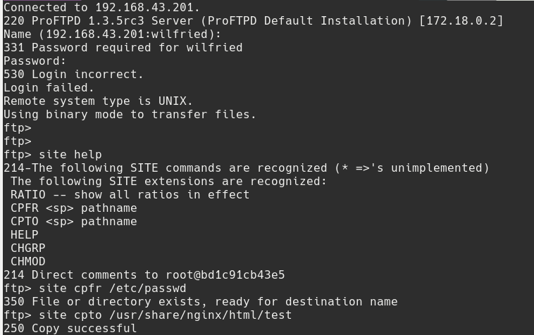
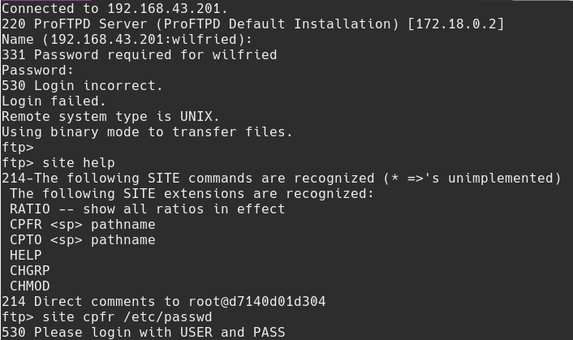

## PROFTPD

### The issue
On machine-1, we noticed a proftpd container running. While investigating, we noticed that it was running with an old version of proftpd: `ProFTPD 1.3.5rc3 Server` (Released in 2013). This version have critical vulnerabilities (Cf. https://www.cvedetails.com/cve/CVE-2015-3306/) that if they are exploited, some data like `/etc/passwd` or other files in the container or new files like HTML for example, can be exposed on the server and retrieved at the URL `http://machine-1/WorkInProgress/${FILE_EXPOSED}`.

### The fix
We decided to install the latest version of proftpd released in february 2020. No vulnerabilities have been detected for now.

